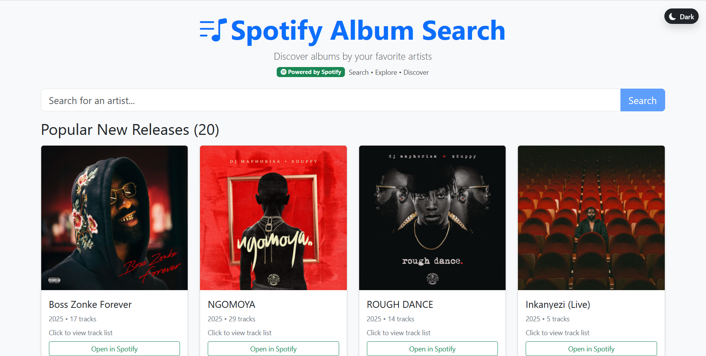
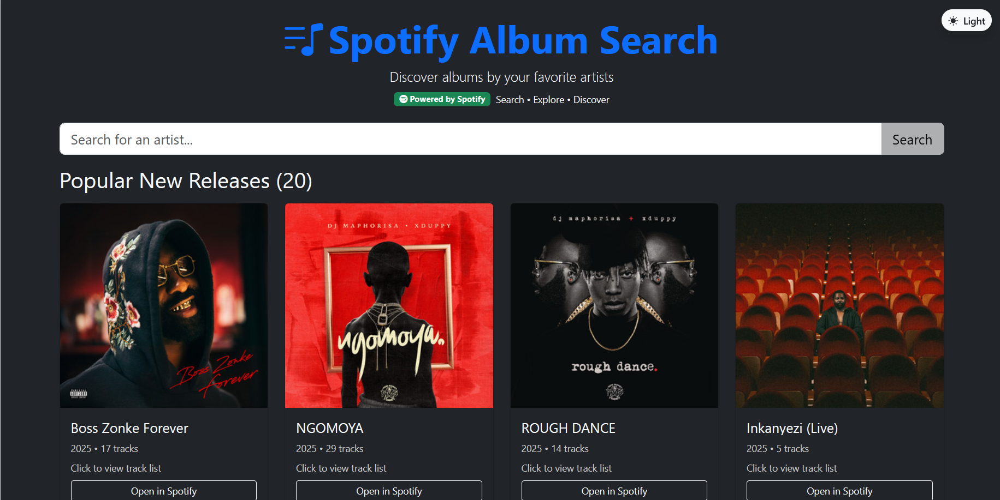
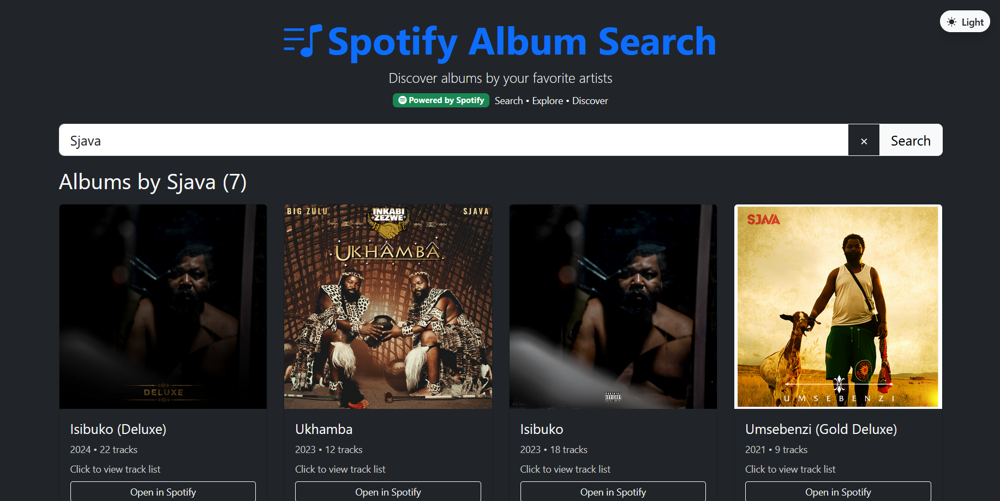
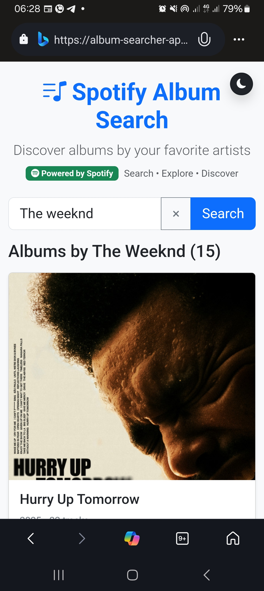
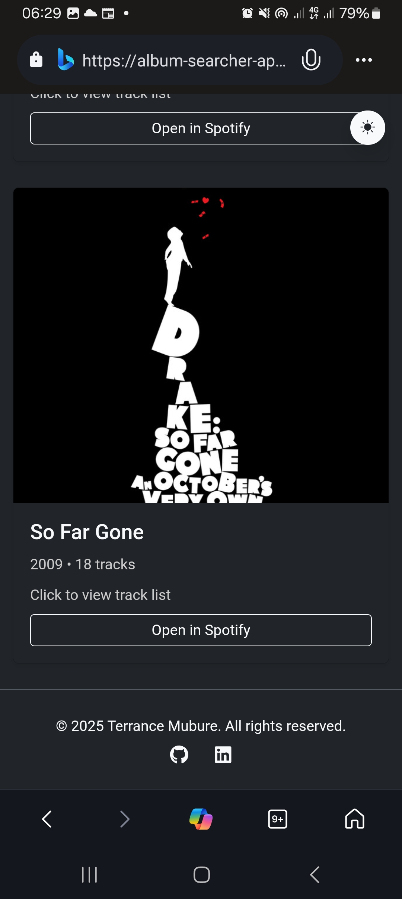

# 🎧 Spotify Album Search App

A modern, responsive web application that enables users to search for music albums using the Spotify Web API. Built with React and TypeScript, featuring a sleek dark theme and real-time search functionality.

[](https://album-searcher-app.vercel.app/)
[](https://github.com/mubureterrance/album-searcher_app)

## Screenshots

### Desktop View

Initial view


Dark Theme


Search results


### Mobile Phone View

initial view


Dark Theme


## ✨ Features

- 🔍 **Real-time Search** - Search albums by keyword with instant results
- 🌑 **Dark Theme** - Modern dark UI with responsive design
- 🎧 **Rich Album Display** - View album covers, names, and artist information
- ⚡ **Fast Performance** - Optimized Spotify API integration
- 🚫 **Error Handling** - Graceful error handling and loading states
- 📱 **Mobile Responsive** - Works seamlessly across all devices
- 🎨 **Clean Interface** - Intuitive and user-friendly design

## 🛠️ Tech Stack

- **Frontend Framework:** React 18 with TypeScript
- **UI Library:** React-Bootstrap
- **Build Tool:** Vite
- **API:** Spotify Web API (Client Credentials Flow)
- **Styling:** CSS3 with custom dark theme
- **Deployment:** Vercel
- **Package Manager:** npm

## 📋 Prerequisites

Before running this application, make sure you have:

- Node.js (v16 or higher)
- npm or yarn
- A Spotify Developer account

## 🚀 Getting Started

### 1. Clone the Repository

```bash
git clone https://github.com/mubureterrance/album-searcher_app.git
cd album-searcher_app
```

### 2. Install Dependencies

```bash
npm install
# or
yarn install
```

### 3. Set Up Spotify API Credentials

1. Visit the [Spotify Developer Dashboard](https://developer.spotify.com/dashboard/)
2. Create a new app or use an existing one
3. Copy your Client ID and Client Secret
4. Create a `.env` file in the root directory:

```env
VITE_SPOTIFY_CLIENT_ID=your_spotify_client_id_here
VITE_SPOTIFY_CLIENT_SECRET=your_spotify_client_secret_here
```

> ⚠️ **Important:** Never commit your `.env` file to version control. It's already included in `.gitignore`.

### 4. Run the Development Server

```bash
npm run dev
# or
yarn dev
```

Open [http://localhost:5173](http://localhost:5173) in your browser to view the application.

## 📁 Project Structure

```
src/
├── components/
│   ├── SearchBar.tsx      # Search input component
│   ├── AlbumCard.tsx      # Individual album display
│   └── LoadingSpinner.tsx # Loading state component
├── services/
│   └── spotifyService.ts  # Spotify API integration
├── types/
│   └── spotify.ts         # TypeScript interfaces
├── hooks/
│   └── useSpotifySearch.ts # Custom search hook
├── App.tsx                # Main application component
├── main.tsx              # Application entry point
├── App.css               # Global styles
└── index.css             # Base styles
```

## 🎯 Usage

1. **Search Albums:** Enter an album name or keyword in the search bar
2. **Browse Results:** Click the "Search" button to fetch results from Spotify
3. **View Details:** Browse through albums with cover art, names, and artist information
4. **Responsive Design:** Use on any device - desktop, tablet, or mobile

## 🔧 Available Scripts

- `npm run dev` - Start development server
- `npm run build` - Build for production
- `npm run preview` - Preview production build locally
- `npm run lint` - Run ESLint
- `npm run type-check` - Run TypeScript compiler check

## 📚 API Reference

This application uses the Spotify Web API with the following endpoints:

- **Search Albums:** `GET https://api.spotify.com/v1/search?q={query}&type=album`
- **Authentication:** Client Credentials Flow

For detailed API documentation, visit: [Spotify Web API Documentation](https://developer.spotify.com/documentation/web-api/)

## 🚀 Deployment

The app is deployed on Vercel. To deploy your own version:

1. Fork this repository
2. Connect your GitHub account to Vercel
3. Import the project
4. Add your environment variables in Vercel dashboard
5. Deploy!

## 🤝 Contributing

Contributions are welcome! Please follow these steps:

1. Fork the repository
2. Create a feature branch (`git checkout -b feature/amazing-feature`)
3. Commit your changes (`git commit -m 'Add some amazing feature'`)
4. Push to the branch (`git push origin feature/amazing-feature`)
5. Open a Pull Request

## 📝 License

This project is licensed under the MIT License - see the [LICENSE](LICENSE) file for details.

## 🐛 Known Issues

- Rate limiting may occur with frequent API calls
- Some albums may not have cover images available

## 🔮 Future Enhancements

- [ ] Add album preview playback
- [ ] Implement user authentication
- [ ] Add search filters (genre, year, etc.)
- [ ] Implement playlist creation
- [ ] Add favorite albums feature
- [ ] Implement infinite scrolling

## 📞 Support

If you encounter any issues or have questions:

- Create an issue on [GitHub](https://github.com/mubureterrance/album-searcher_app/issues)
- Check the [Spotify API documentation](https://developer.spotify.com/documentation/web-api/)

## 🙏 Acknowledgments

- [Spotify Web API](https://developer.spotify.com/documentation/web-api/) for providing the music data
- [React](https://reactjs.org/) and [TypeScript](https://www.typescriptlang.org/) communities
- [Vercel](https://vercel.com/) for hosting

---

⭐ If you found this project helpful, please give it a star on GitHub!

## 📊 Project Stats


